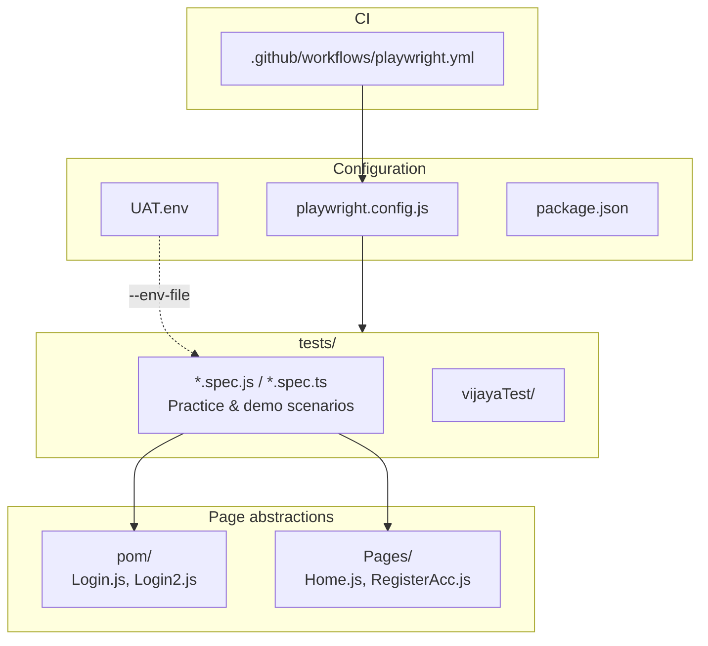
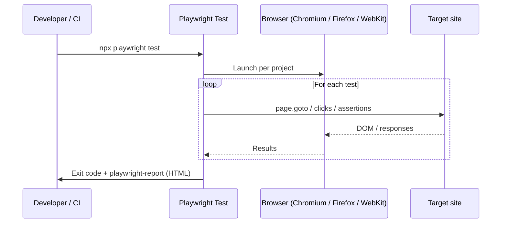
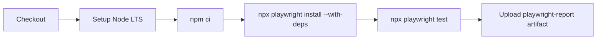

# Playwright Test

A learning and practice repository for end-to-end browser automation with [Playwright](https://playwright.dev/). Tests target public demo sites (for example [Sauce Demo](https://www.saucedemo.com/), [Playwright docs](https://playwright.dev/)), and the suite is wired for multi-browser runs and GitHub Actions CI.

## Prerequisites

- [Node.js](https://nodejs.org/) (LTS recommended; CI uses `lts/*`)
- npm (ships with Node)

## Quick start

```bash
npm ci
npx playwright install
```

Run the full suite (default `testDir` is `./tests`):

```bash
npx playwright test
```

Useful variants:

| Goal | Command |
|------|---------|
| Interactive UI mode | `npx playwright test --ui` |
| Single file | `npx playwright test tests/example.spec.js` |
| One browser project | `npx playwright test --project=chromium` |
| Headed (see the browser) | `npx playwright test --headed` |
| HTML report (after a run) | `npx playwright show-report` |

Tests that read `process.env` (for example `tests/envFileDemo.spec.js`) can be run with an env file:

```bash
npx playwright test tests/envFileDemo.spec.js --env-file=UAT.env
```

> **Note:** `e2e/` contains example specs, but `playwright.config.js` sets `testDir` to `./tests`, so those files are **not** included in a plain `npx playwright test` run unless you point at them explicitly or change the config.

## Repository layout



| Path | Purpose |
|------|---------|
| `tests/` | Main test directory (matches `testDir` in config). Mix of `.js` and `.ts` specs, tags like `@smoke` on some tests. |
| `pom/` | Page Object style helpers (for example Sauce Demo login locators and actions). |
| `Pages/` | Additional page-level helpers. |
| `e2e/` | Standalone examples; not in default `testDir`. |
| `playwright.config.js` | Projects for **Chromium**, **Firefox**, and **WebKit**; HTML reporter; CI-oriented retries and workers. |
| `UAT.env` | Sample env vars for demo URLs and credentials (Sauce Demo–style). |

## How a typical test run flows



## Continuous integration

On push or pull request to `main` or `master`, GitHub Actions installs dependencies, installs browsers with OS deps, runs `npx playwright test`, and uploads the HTML report as an artifact (`playwright-report/`, 30-day retention).



## Configuration highlights

From `playwright.config.js`:

- **Parallelism:** `fullyParallel: true` locally; **single worker** on CI with **retries** enabled when `CI` is set.
- **Safety:** `forbidOnly: true` on CI so accidental `test.only` fails the job.
- **Reporter:** `html` (open with `npx playwright show-report`).
- **Tracing:** `trace: 'off'` by default (enable per test or in config if you need traces).

## Optional tooling

- **playwright-bdd** is listed in `devDependencies` for Cucumber-style workflows; current specs in this repo are standard `@playwright/test` tests unless you add BDD features separately.

## License

ISC (see `package.json`).
